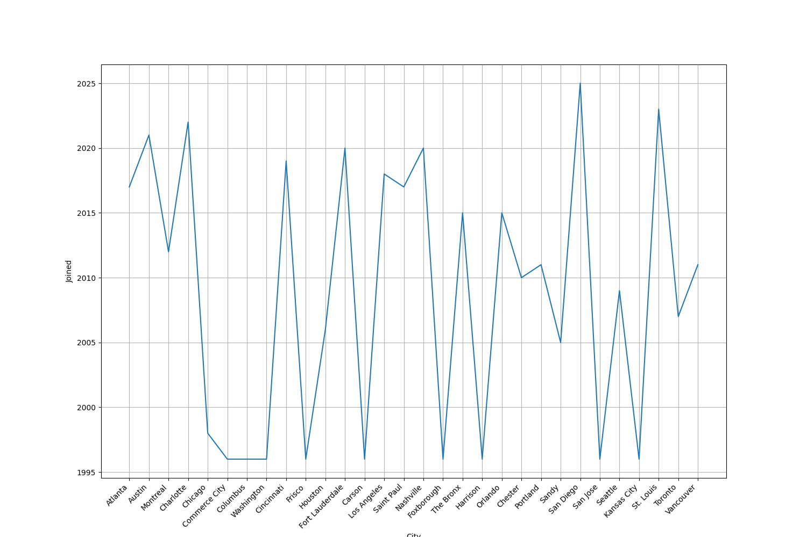

# cs-data-project

In this CS project, I looked at a CSV file about MLS teams with python. I made two graphs to show when teams joined and how big their stadiums are.

See the project instructions (https://github.com/teacher-aj/HeschelCS/blob/main/project_02_visualizing_datasets/README.md).

## Attached Files
I am attaching these files:

1.  **chart1.png** and **chart2.png**, The two graphs (below)
2.  **mls.py**, The python file that generated the plots.
3.  **mls.csv**, The CSV file I used from the soccer datasets.
4.  **README.md**, This file describes my project.

**MLS Teams Joined By City**

This line chart shows the year each city joined the MLS. The graph shows that the league started in 1996 and has grown a lot since then.
Original data source: https://github.com/gavinr/usa-soccer/blob/master/mls.csv

**Stadium Capacity By State**

(A chart of stadium capacities across states)(chart2.png)

This scatter plot shows the stadium capacity for teams in different states. The code checks for small (less than10,000) and large (more than 10,000) stadiums. The graph shows that all MLS teams in this dataset play in large stadiums, with the smallest holding 18,000 people.

Original data source: https://github.com/gavinr/usa-soccer/blob/master/mls.csv
